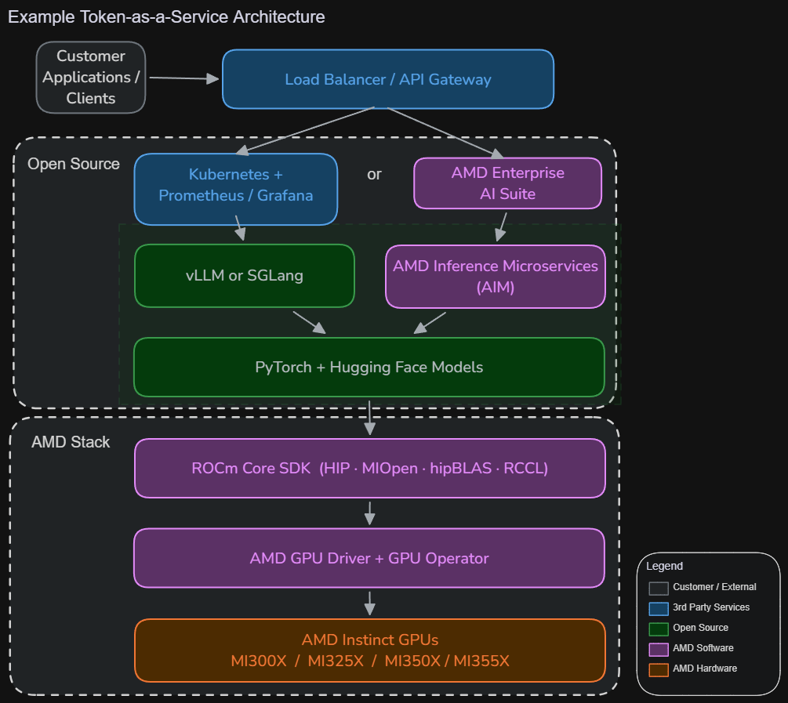

# Inference as a Service

Last reviewed: 2026-03-31

This example architecture shows how the ecosystem building blocks compose for
a customer building an inference-as-a-service business — for example, LLM API
endpoints powered by AMD Instinct GPUs.

## Architecture overview

## Two deployment paths

Both paths use the same **ROCm Core SDK** and **AMD GPU drivers** as their
foundation. The choice depends on your operational requirements.

### Self-managed open source path

Full control over component selection; assemble your own stack from open source building blocks.

| Layer | Components |
|-------|------------|
| **Inference engine** | [vLLM](https://docs.vllm.ai/) or [SGLang](https://sgl-project.github.io/) |
| **Framework** | [PyTorch](https://pytorch.org/) + [Hugging Face](https://huggingface.co/docs/transformers/) |
| **GPU software** | [ROCm Core SDK](../amd-components.md#rocm-core-sdk) |
| **Infrastructure** | [AMD GPU Operator](https://instinct.docs.amd.com/projects/gpu-operator/en/latest/) on Kubernetes |
| **Monitoring** | [Prometheus](https://prometheus.io/) + [Grafana](https://grafana.com/) via [Device Metrics Exporter](https://instinct.docs.amd.com/projects/device-metrics-exporter/en/latest/) |

### AMD Enterprise AI Suite path

Also open source with no licensing requirements, the Enterprise AI Suite adds
a well-designed web UI, enterprise authentication integration (SSO/IAM/RBAC),
and pre-validated AI components — all built on the same Kubernetes foundation.

| Layer | Components |
|-------|------------|
| **Inference engine** | [AMD Inference Microservices (AIM)](https://enterprise-ai.docs.amd.com/en/latest/aims/overview.html) |
| **Development** | [AMD AI Workbench](https://enterprise-ai.docs.amd.com/en/latest/workbench/overview.html) |
| **Resource management** | [AMD Resource Manager](https://enterprise-ai.docs.amd.com/en/latest/resource-manager/overview.html) |
| **GPU software** | [ROCm Core SDK](../amd-components.md#rocm-core-sdk) |
| **Infrastructure** | [AMD GPU Operator](https://instinct.docs.amd.com/projects/gpu-operator/en/latest/) on Kubernetes |

## Key decision points

- **Control vs. convenience:** The self-managed path gives full control over
  every component. The Enterprise AI Suite reduces operational burden with a
  web UI, pre-validated containers, and built-in resource management.
- **Licensing:** Both paths are fully open source with no AMD licensing
  requirements.
- **Enterprise integration:** The Enterprise AI Suite includes built-in RBAC
  and federation with existing SSO and IAM solutions, which teams assembling
  their own stack must configure separately.
