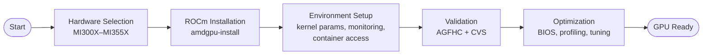
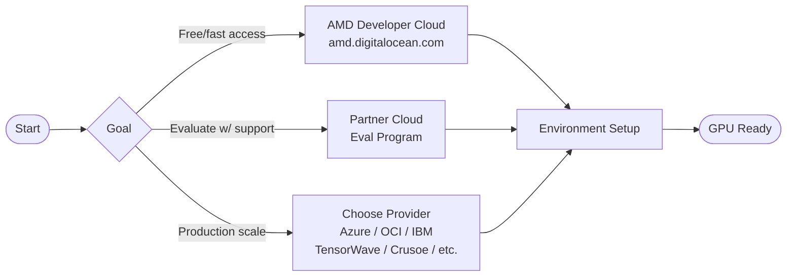
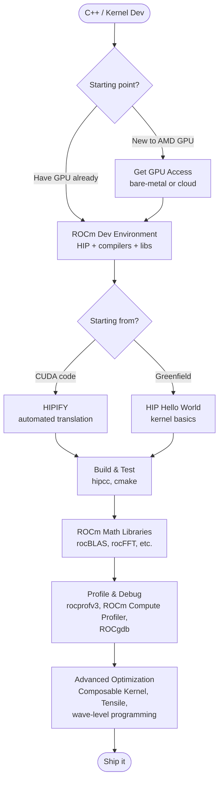
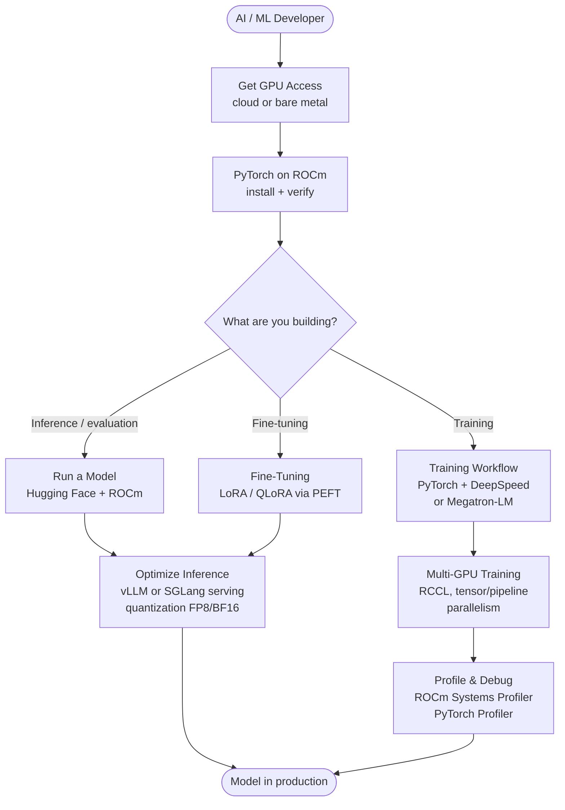
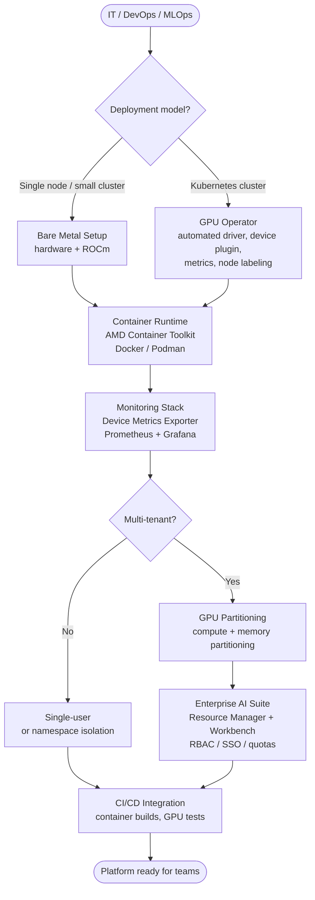

## Current State Summary

The site has two journeys today, both **infrastructure/deployment-oriented**:

- **Bare Metal**: Hardware selection → ROCm install → Environment setup → Validation → Optimization
- **Cloud**: Provider selection → Per-provider provisioning → Environment setup

There's also an **Ecosystem** section (software stack reference) and **Reference Architectures** (one so far: Inference as a Service).

The journeys are solid for "how do I get GPU access" but stop short of "now what do I do with it?" — there's nothing persona-specific and nothing that takes a developer from GPU access to actually building something.

---

## Existing Journeys — Mermaid Diagrams

Here's what the documented journeys look like, for reference when we add these to the site:

**Bare Metal Journey**


**Cloud Journey**


---

## Proposed Persona Journeys

### Persona 1: C++/Kernel Developer

**Who**: Low-level GPU programmers, CUDA developers evaluating AMD, folks writing or optimizing custom kernels.

**Their question**: "How do I write GPU code for AMD hardware, and how do I port my existing CUDA work?"

**Proposed journey flow:**


**Key content gaps to fill**: HIP programming primer, HIPIFY walkthrough, rocBLAS/rocFFT usage, kernel profiling with rocprofv3, ROCgdb debugging guide.

---

### Persona 2: AI/Data Science Developer (PyTorch / Framework Level)

**Who**: ML researchers, model developers, fine-tuning engineers, people who work above the framework API and don't write kernels.

**Their question**: "How do I run my PyTorch workloads on AMD, fine-tune models, and serve them?"

**Proposed journey flow:**


**Key content gaps to fill**: PyTorch on ROCm setup guide, HF models on ROCm, fine-tuning walkthrough (LoRA), vLLM/SGLang getting started, quantization guide.

---

### Persona 3: IT Infrastructure / DevOps / MLOps

**Who**: Platform engineers, cluster admins, MLOps practitioners who provision and manage GPU infrastructure for teams.

**Their question**: "How do I stand up AMD GPU infrastructure that my data science team can actually use?"

**Proposed journey flow:**


**Key content gaps to fill**: GPU Operator deployment guide, Prometheus/Grafana stack setup, multi-tenant GPU partitioning, Enterprise AI Suite deployment, CI/CD patterns for GPU workloads.

---

## Additional Journeys Worth Adding

Beyond the three personas, a few more gap areas stand out:

| Journey | Who it's for | Key gap |
|---|---|---|
| **HPC / Scientific Computing** | HPC researchers, MPI users | GPU-aware MPI, OpenMP offloading, rocBLAS for HPC, multi-node scaling |
| **LLM Inference as a Service** | Teams building LLM APIs | Expands the existing reference arch into a full walkthrough (vLLM/SGLang + monitoring + scaling) |
| **CUDA → ROCm Migration** | Developers porting existing NVIDIA workloads | HIPIFY, compatibility testing, common gotchas, CI validation strategy |
| **Model Fine-Tuning End-to-End** | Applied AI teams | From dataset → fine-tuned model → serving, as a self-contained story |
| **AI Workbench / Developer Platform** | Teams using Enterprise AI Suite | Getting developers productive on a managed platform |

---

## Structural Proposal

Right now the site top-level is: `Bare Metal | Cloud | Ecosystem`. I'd suggest evolving toward something like:

```
Start Here (where/how do I access a GPU?)
  ├── Bare Metal
  └── Cloud

What do you want to build?  ← NEW
  ├── C++ / Kernel Development
  ├── AI / ML Development (PyTorch)
  ├── Platform / Infrastructure (DevOps/MLOps)
  ├── LLM Inference Service
  └── [others]

Reference
  ├── Software Ecosystem
  └── Example Architectures
```

The "Start Here" journeys become prerequisites that the persona journeys reference, rather than standalone end-to-end paths. This keeps them DRY while making it easy for each persona to find their entry point.

---

Pausing here for your review. A few questions to help sharpen the direction:

1. **Depth vs. breadth**: Should persona journeys be self-contained how-tos (with actual commands and configs), or navigation guides that link out to existing docs (ROCm, Instinct docs, etc.) like the current journeys tend to be?
2. **Overlap with existing AMD docs**: The ROCm docs already cover some of this well (e.g., PyTorch install, fine-tuning guides). Do you want this site to duplicate/consolidate that, or curate and link?
3. **Contributor model**: Since the team is new, are any of these personas closer to home (i.e., you have SMEs internally who could draft the C++ or MLOps sections more readily than others)?
4. **Priority**: If you had to pick one persona journey to build first, which would it be?